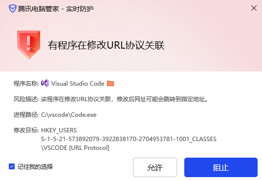

## 已打包好vscode和resource_hacker工具

## 实现步骤
1. 官网下载vscode zip文件
2. ./resources/app/out 目录下搜索内容.setAppUserModelId,将其()内容改名,即可区分任务栏应用
3. 使用 resource_hacker.exe 修改图标

## 若遇到警告
  
因为修改了图标,需要重新签名,这里没去做所以有警告是正常的.