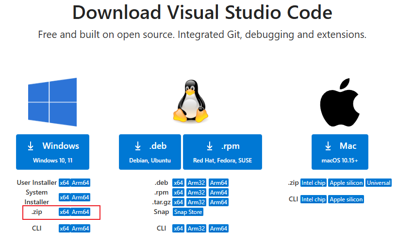

## 已打包好vscode和修改图标的resource_hacker工具,可直接下载使用:

```
git clone https://github.com/xghini/vscode.git
```

## 实现步骤
1. 官网下载vscode zip文件,解压后在根目录创建data文件夹存放配置

2. vscode/resources/app/out 目录下搜索内容.setAppUserModelId,将其()内容改名,即可区分原本的VSCODE应用
3. 使用 resource_hacker.exe 修改图标

## 若遇到警告
  

因为修改了图标,需要重新签名,这里没去做所以有警告是正常的 
 
推荐自己打包,按上面步骤操作即可   
